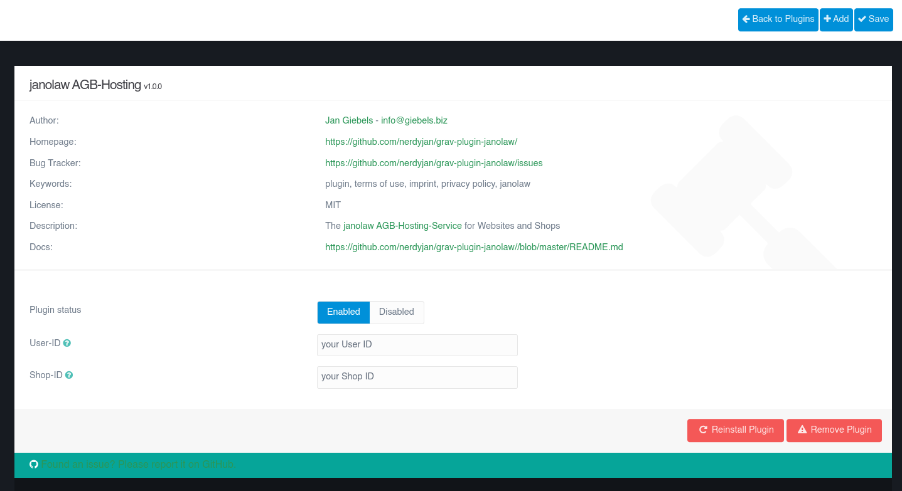

# janolaw AGB-Hosting Plugin


`janolaw AGB-Hosting` is a [Grav](http://github.com/getgrav/grav) plugin that provides legal document support from [janolaw GmbH](https://janolaw.de).

Protect your internet presence (homepage, company website, blog) permanently against warnings with an individual data protection declaration (GDPR) and an imprint.With this plugin the pages get updated automatically as soon as the law changes. Optional: Legal texts in English and French with help.



# Installation

Installing the plugin can be done in one of two ways. Our GPM (Grav Package Manager) installation method enables you to quickly and easily install the plugin with a simple terminal command, while the manual method enables you to do so via a zip file.

## GPM Installation (Preferred)

The simplest way to install this plugin is via the [Grav Package Manager (GPM)](http://learn.getgrav.org/advanced/grav-gpm) through your system's Terminal (also called the command line).  From the root of your Grav install type:

    bin/gpm install janolaw

This will install the janolaw AGB-Hosting plugin into your `/user/plugins` directory within Grav. Its files can be found under `/your/site/grav/user/plugins/janolaw`.

## Manual Installation

To install this plugin, just download the zip version of this repository and unzip it under `/your/site/grav/user/plugins`. Then, rename the folder to `janolaw`. You can find these files either on [GitHub](https://github.com/nerdyjan/grav-plugin-janolaw) or via [GetGrav.org](http://getgrav.org/downloads/plugins#extras).

You should now have all the plugin files under

    /your/site/grav/user/plugins/janolaw

# Usage

The `janolaw AGB-Hosting` plugin requires some configuration. 

- set your user-id
- set your shop-id

Both can be set at the admin plugins page [here](/admin/plugins/janolaw) if you have the admin plugin installed. Otherwise you need to set it manually at `/your/site/grav/user/config/plugins/janolaw.yaml`

You do further need to add the Twig funtion into your own pages somewhere you want the available documents to be displayed.

```twig
---
process:
    twig: true
---

{{ janolaw("legaldetails")|raw }}
```

Notice the `process:` declaration needed on every page where you use the `{{janolaw()}}` twig function. As the plugin outputs raw HTML, the `|raw` suffix should be used if you want the document content rendered.

Please feel free to adjust the look with your own CSS, consult you used themes documentation for further details.

Available documents and languages depend on your purchased service, as there are:

- `legaldetails` for mprint
- `terms` for terms of use
- `datasecurity` for privacy policy
- `revocation` for cancellation policy
- `model-withdrawal-form` for cancellation form (only PDF)

The language is selected by your default site language or, if you run a multilingual site the user selected language.

Available languages (depending on purchased package):

- German
- English
- French

# Updating

As development for the janolaw AGB-Hosting plugin continues, new versions may become available that add additional features and functionality, improve compatibility with newer Grav releases, and generally provide a better user experience. Updating janolaw AGB-Hosting is easy, and can be done through Grav's GPM system, as well as manually.

## GPM Update (Preferred)

The simplest way to update this plugin is via the [Grav Package Manager (GPM)](http://learn.getgrav.org/advanced/grav-gpm). You can do this with this by navigating to the root directory of your Grav install using your system's Terminal (also called command line) and typing the following:

    bin/gpm update janolaw

This command will check your Grav install to see if your janolaw AGB-Hosting plugin is due for an update. If a newer release is found, you will be asked whether or not you wish to update. To continue, type `y` and hit enter. The plugin will automatically update and clear Grav's cache.

> Note: Any changes you have made to any of the files listed under this directory will also be removed and replaced by the new set. Any files located elsewhere (for example a YAML settings file placed in `user/config/plugins`) will remain intact.

## Configuration

Simply copy the `user/plugins/janolaw/janolaw.yaml` into `user/config/plugins/janolaw.yaml` and make your modifications.

```yaml
enabled: true
userid: 'your user id'
shopid: 'your shop id'
```

Options are pretty self explanatory.

